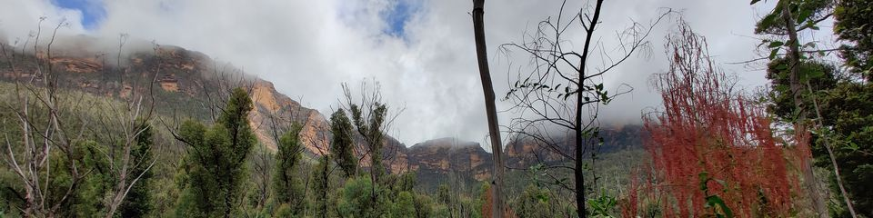
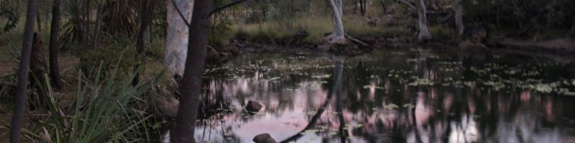
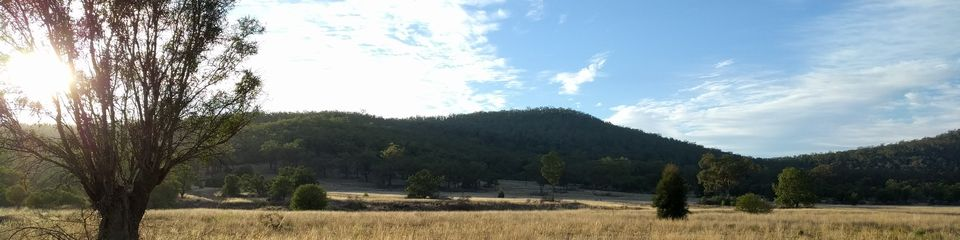

This page is a short summary of the full Flora Connections guide, which can be downloaded separately for screen-viewing or printing. It has more resources for plant identification, as well as full instructions and examples of how to fill out a Flora Connections data sheet.

<a href="_assets/files/Flora Connections Guide.pdf">Download the Flora Connections guide <small>(.PDF, 4 MB)</small></a>

## What is the aim of Flora Connections?

Many Australian plants are adapted to fire, and some even need fire to reproduce. But
some Australian plants and ecosystems are not well adapted to fires, and even those
that are may not be able to persist when fires are too frequent and too intense.
Plants that are already impacted by habitat loss, drought, or disease can have a
harder time recovering from such fires.

Deciding if a plant population has been harmed by fire depends on local conditions:
How severe was the fire? Did it burn the whole population or only part of it? We need
local knowledge to answer these questions and more. **On-site observations help us
better understand which Australian plants are under threat. And that's where you and Flora
Connections can help!**

## What do I need to bring for surveys?

Your safety is the most important thing: Always let someone know where you're going and when you expect to be back, and bring a mobile phone, food and water, and appropriate clothing.

When you're looking for native plants, it is important not to bring new diseases or threats to the area. Make sure you clean your shoes before your visit by scrubbing them and washing them with methylated spirits. 

You will also need a printed copy of the [Flora Connections data sheet](submit), a pen or pencil (we prefer pencil because it can still write on damp paper), and a clipboard to write on. If you are going out to identify plant species, you may want to bring a field guide such as _Field Guide to Australian Wildflowers_ and a magnifying glass to see small features.

## The Flora Connections process

### Step 1: Find a native plant in your area

After the 2019-20 bushfires, researchers put together a list of **Priority Plants**
that may be at particular risk. You can use our [Priority Plants Finder](priority-plants) to see if any of them are near you.

Your local knowledge is important here too: Are there plants in your area that have been
affected by recent fires or floods? By drought, clearing or disease? Have some plants disappeared from the area recently? You can use the [Australasian Virtual Herbarium](https://avh.ala.org.au/) to find information about a plant you'd like to study.

Remember to [download and print a data sheet](submit) and bring it with you to the field!

### Step 2: Identify the plant species

The best way to identify your plant is to use a field guide or a published key. You can even use an online key such as [Flora of Australia](http://www.ausflora.org.au/) or [NSW Flora Online](https://plantnet.rbgsyd.nsw.gov.au/).

The next-best way is to use [iNaturalist](https://inaturalist.ala.org.au/) (free app on iOS and Android) to upload a sighting. If you are connected to the internet, iNaturalist can look at your photo and suggest a species identification, and other users can double-check it. **If you are submitting a sighting for a rare plant, especially orchids or succulents, set the Geoprivacy of the sighting to 'Obscured' or 'Private' to discourage illegal collectors.**
)

### Step 3. Record the plant's location and habitat

The survey asks you to describe your location. If you have a GPS unit or your phone then you can enter your latitude and longitude on-site, but you can also mark it on a map later when you submit your data.

Recording the plant's habitat is useful as it helps ecologists predict where else
this plant might grow. Try to include the most distinctive features of the
habitat in this description. For example, if the plant is growing only between rock
outcrops or in waterlogged soil.

If you have thoroughly looked for a plant species but haven't found it, **this is still
very useful data**! Please still fill out your Flora Connections survey sheet and tell us
what species you were looking for and how long you spent searching. You can also make notes
about when the species was last seen in this area in the "Survey notes" section.

### Step 4: Assess what's threatening the plant population

Our data sheet suggests common threats to plant populations (feral animals, disease, fire, etc.) We ask you to estimate when this threat occurred (in the past, currently, or in the future), and whether this threat is an actual one (certainly affecting the species) or a potential one (it may or may not affect it). For example, evidence of feral pigs digging up other plants along the trail could be a current and future potential threat.

It is important to let us know what evidence you've seen for the threat. For example,
you might note that you saw digging by feral pigs near the plant, or leaf damage from
disease. Please take as many photos of threats or disturbances as you can. We
especially want to know whether fire has affected the plant. If you know the date of
last fire, or how many years are usually between fires in this area, please add this.

### Step 5: Do a species population survey

The number of plants in a population is crucial. It helps us estimate how many plants
are growing in the wild in total, and whether the population is increasing or
decreasing. This information is vital to deciding if the species is under threat.

Counting individual plants is sometimes impossible, like when the species grows along
the ground in a mat. For these plants it is important to be consistent in how you
count them. You can decide to count each separate stem, or define your own unit of
measure. For example, each patch with more than 10cm of bare ground around it could
be a separate unit. Choose what you think is most appropriate for the plant. Just be
consistent about what you are counting, and make clear notes.

### Step 6: Upload your data to Flora Connections

Once you're home from the field, it's time to upload your survey data.

<a href="submit" class="link_as_button">Submit your data</a>

After you've submitted your data (thank you!) you can keep your original paper copy in a safe place, or scan/photograph it as a backup. 

If you have more questions, check out our [Frequently Asked Questions](faq) or [get in touch with us](contact). And if you want more information about any step in the Flora Connections process, remember to [download and read the full guide (.PDF, 4 MB)](_assets/files/Flora Connections Guide.pdf).

