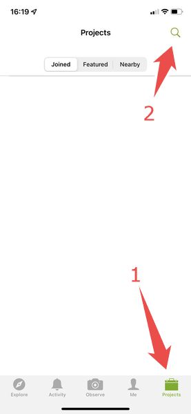
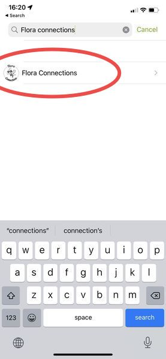
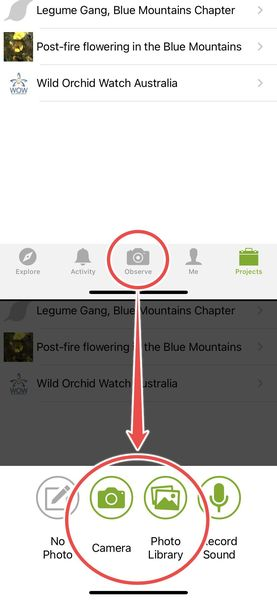
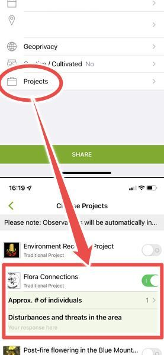
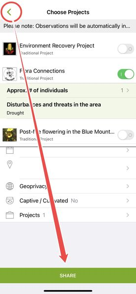

## Step 1: Do the survey

Flora Connections surveys are recorded on paper. We recommend bringing a clipboard and using a dark pencil, because pencils can still write on damp paper.

<a href="_assets/files/Flora Connections data sheet v3.pdf" class="link_as_button">Download a printable data sheet <small>(.PDF, 0.19 MB)</small></a>

Full instructions for filling out a data sheet can be found in the [complete guide (.PDF, 4 MB)](_assets/files/Flora Connections Guide.pdf).

You can also print this [completed example data sheet (.PDF, 0.26 MB)](_assets/files/Flora Connections data sheet v3 examples.pdf) to refer to in the field.

## Step 2: Upload the survey

Once your survey is complete, bring it back home and copy it into our online form. We collect data through _BioCollect_, which makes your surveys immediately accessible to scientists and government agencies.

<a href="https://biocollect.ala.org.au/acsa/bioActivity/create/6ac64949-30e3-485a-b5d7-53f740f2fff3" class="link_as_button">Submit your survey here <small>Goes to <em>biocollect.ala.org.au</em></small></a>

You will be asked to sign in with your _Atlas of Living Australia_ account. If you don't have one yet, you can [make an ALA account here](https://auth.ala.org.au/userdetails/registration/createAccount).

## Or contribute quickly through iNaturalist

If you can't do the full survey, you can add a quick two-question observation through the iNaturalist app on iPhone or Android instead.

### **Step 1.** Install iNaturalist on your phone, and create an account with it or sign into your existing one.

    

        
         
        <strong>Inaturalist on iOS</strong>
    

    

        
         
        <strong>Inaturalist on Android</strong>
    

### **Step 2.** Join the [_Flora Connections_ project](https://inaturalist.ala.org.au/projects/flora-connections).

    

        
         
        Search for 'Flora Connections'.
    

    

        
         
        Select the project and choose <Strong>Join</strong> at the top of the page.
    

### **Step 3.** Take a photo of a plant you want to submit.

    

        
         
        You can take a photo in the field, or choose an existing photo in your album.
    

    

        
         
        Open 'Projects' to answer Flora Connections' required fields.
    

### **Step 4.** Answer our questions and _Share_ the observation!

We want to know **how many individuals** you're seeing at the site, and **what disturbances have been happening, or will occur in the future**. Disturbances include disease, herbivory, human impacts, feral animals, erosion, weeds, flood, drought, and fire.

    

        
         
        Answer the questions, go <strong>back</strong>, and choose <strong>Share</strong>.
    

